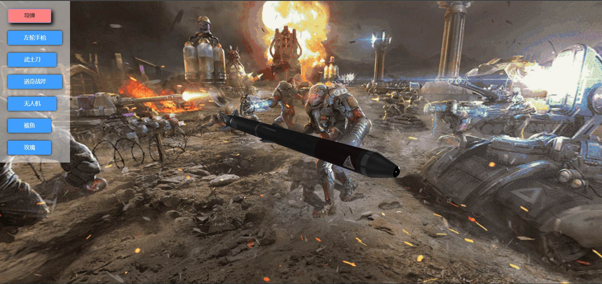

# threeJs加载3d模型
* 浏览链接：https://xi1213.gitee.io/three-load-model
* 项目链接：https://gitee.com/xi1213/three-load-model
* csdn文章：https://blog.csdn.net/xi1213/article/details/123244316
# 项目简介
* 支持模型切换。
* 支持全景图查看。
* 支持鼠标操控模型缩放旋转。
# 相关技术
* vue2主体框架。
* three.js生成场景、加载模型。
# 项目使用
* 安装依赖：npm install
* 项目运行：npm run serve
* 项目打包：npm run build
# 详情说明

* 左边切换模型与场景。
* 鼠标可在场景中旋转缩放模型。